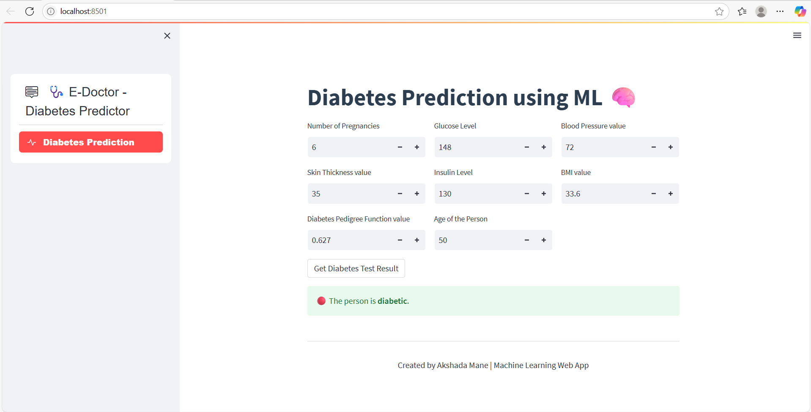

# 🩺 Diabetes Disease Prediction Web App

A Machine Learning-powered Streamlit web application that predicts whether a person is diabetic based on medical attributes like glucose level, BMI, age, and more.

---

## 🔍 About the Project

This project uses a trained classification model (based on the PIMA Indian Diabetes Dataset) to predict the likelihood of diabetes. The app provides an easy-to-use interface for users to input health data and get real-time predictions.

---

## 🚀 Features

- 🔮 Predicts whether a person is diabetic using ML
- 📊 User-friendly interface built with Streamlit
- 📂 Organized code with separate model and frontend files
- ✅ Input validation and enhanced UI design
- 🧠 Pre-trained model loaded via `pickle`

---

## 🧠 Model Information

- **Dataset:** PIMA Indian Diabetes Dataset (Kaggle)
- **Model Used:** Random Forest / Logistic Regression (as saved in `diabetes.sav`)
- **Frameworks:** scikit-learn, Streamlit

---

## 🛠️ Tech Stack

- Python 3
- Streamlit
- NumPy
- Scikit-learn
- Pickle
- streamlit-option-menu

---

## 🖥️ How to Run Locally

### 1️⃣ Clone the Repository

```bash
git clone https://github.com/AkshadaMane26/diabetes-disease-prediction.git
cd diabetes-disease-prediction
```

### 2️⃣ Install Dependencies

```bash
pip install -r requirements.txt
```

### 3️⃣ Run the Streamlit App

```bash
streamlit run diseasepred.py
```

## 📌 Sample Test Inputs
| **Field**                  | **Sample (Diabetic)** | **Sample (Non-Diabetic)** |
| -------------------------- | --------------------- | ------------------------- |
| Pregnancies                | 6                     | 1                         |
| Glucose Level              | 148                   | 85                        |
| Blood Pressure             | 72                    | 66                        |
| Skin Thickness             | 35                    | 29                        |
| Insulin Level              | 130                   | 0                         |
| BMI                        | 33.6                  | 26.6                      |
| Diabetes Pedigree Function | 0.627                 | 0.351                     |
| Age                        | 50                    | 31                        |

## 🖼️ Output



## 🧑‍💻 Author
Akshada Mane
📧 makshada200$@gmail.com

📜 License
This project is open-source and available under the MIT License.

🌟 Show your support
If you like this project, give it a ⭐ on GitHub and share it with others!

---

